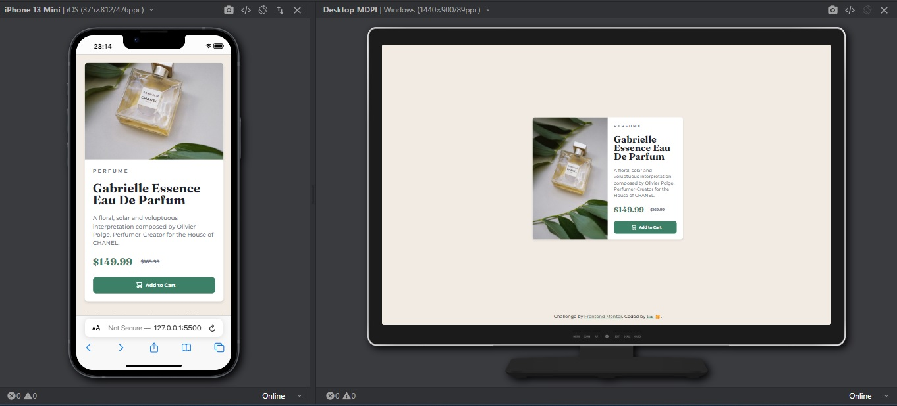

# Frontend Mentor - Product preview card component solution

This is a solution to the [Product preview card component challenge on Frontend Mentor](https://www.frontendmentor.io/challenges/product-preview-card-component-GO7UmttRfa). Frontend Mentor challenges help you improve your coding skills by building realistic projects.

## Table of contents

- [Overview](#overview)
  - [The challenge](#the-challenge)
  - [Screenshot](#screenshot)
  - [Links](#links)
- [My process](#my-process)
  - [Built with](#built-with)
  - [What I learned](#what-i-learned)

## Overview

### The challenge

Users should be able to:

- View the optimal layout depending on their device's screen size
- See hover and focus states for interactive elements

### Screenshot



### Links

- Solution URL: [Tsu solution](https://www.frontendmentor.io/solutions/product-preview-card-component-with-tailwindcss-8wZxRQBE8x)
- Live Site URL: [GitHub pages deploy](https://tsuramii.github.io/product-preview-card-component-main/)

## My process

### Built with

- Semantic HTML5 markup
- Tailwind
- Flexbox
- Mobile-first workflow
- [TailwindCSS](https://tailwindcss.com/) - CSS Framework

### What I learned

During this project, I gained valuable insights into responsive web design and how to optimize images for different devices. One of the key learnings was how to use the picture element and the srcset attribute to serve different images based on the device's screen width. This is essential for ensuring a smooth and efficient user experience on various devices.

Here's the code snippet I used to implement responsive images:

```html
<picture>
  <source srcset="./images/image-product-mobile.jpg" media="(max-width: 767px)">
  <source srcset="./images/image-product-desktop.jpg" media="(min-width: 768px)">
  
</picture>
```
